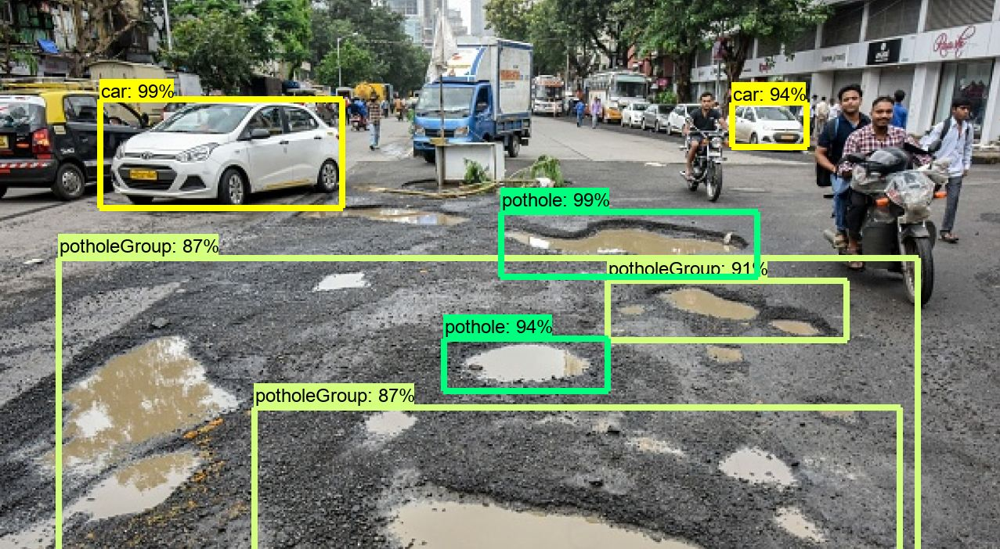

# Pothole-detection-using-Tensorflow-Object-Detection-API
Custom object detection classifier, detecting Potholes on roads. Used Tensorflow Object Detection API

## Brief Summary
This repository is the application of learned knowledge of 'Object Detection Using Tensorflow'.
This repo is all about detecting Potholes on an image of a road having potholes and the process I followed in doing so.

  

This model is trained to detect and differentiate 4 different classes,namely
1. Pothole
2. Pothole Group (Having more than 2 potholes on the image or a Big Pothole. PS:Created this caz to escape labelling each and every tiny pothole in the image :P which is extremely a gruelling task)
3. Car
4. Auto

I had labelled and trained the model in such way that detecting Pothole and Pothole group is the main priority.

## Implementation
#### 1. Gather required images and label them.
I had got the Pothole images dataset from [Kaggle](https://www.kaggle.com/sachinpatel21/starter-code-to-view-dataset-images/data)
I had used [LabelImg](https://github.com/tzutalin/labelImg) which is an open tool for labelling your images.
#### 2. Set up TensorFlow Directory and Anaconda Virtual Environment
The TensorFlow Object Detection API requires using the specific directory structure provided in its GitHub repository. It also requires several additional Python packages, specific additions to the PATH and PYTHONPATH variables, and a few extra setup commands to get everything set up to run or train an object detection model.

After wasting a lot of time and efforts I went for training using TensorFlow v1.5 and this [GitHub commit](https://github.com/tensorflow/models/tree/079d67d9a0b3407e8d074a200780f3835413ef99) of the TensorFlow Object Detection API.
You have to choose the correct vesion of Tensroflow and compatible Tensorflow object Detection API Git Commit.Otherwise your code may be end up with lot of errors and code breaks.

#### 3. Model used: Faster-RCNN-Inception-V2-COCO model from TensorFlow's model zoo
TensorFlow provides several object detection models (pre-trained classifiers with specific neural network architectures) in its [model zoo](https://github.com/tensorflow/models/blob/master/research/object_detection/g3doc/detection_model_zoo.md)

#### 4. Install all the required Python Libraries present in requirements.txt
It is better you create a Anaconda virtual environment and do your stuff in there.
#### 5. Training and exporting the Inference graph.
I had trained this model on my machine(4GB RAM) for like 50 hours.

## References:
This implimentation took a lot of inspiration from EdgeElectronics tutorial of training a custom object detection.
(https://github.com/EdjeElectronics/TensorFlow-Object-Detection-API-Tutorial-Train-Multiple-Objects-Windows-10#brief-summary)
